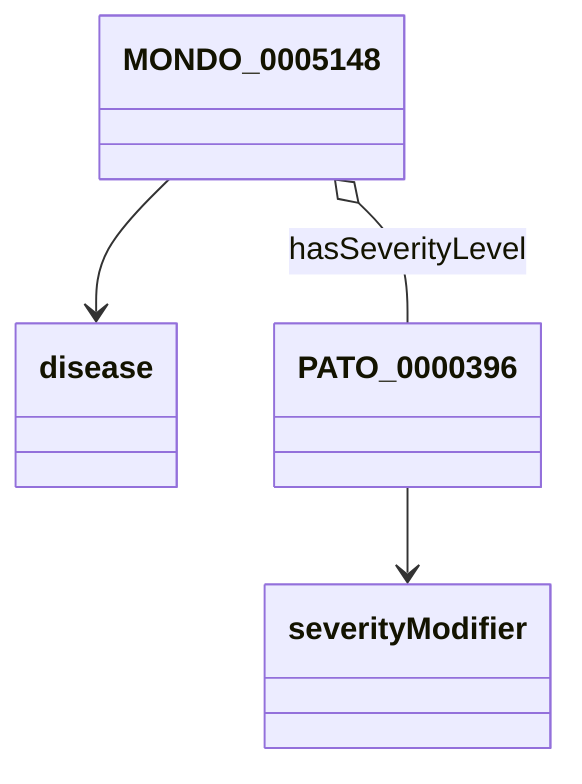

# Proposal for encoding complex expressions in URIs

Simple URIs for classes and properties are ubiquitous in the Semantic Data domain. 
For example, the URI [http://purl.obolibrary.org/obo/MONDO_0035401](http://purl.obolibrary.org/obo/MONDO_0035401) 
refers to the class of "isolated anencephaly" (a disease), and anyone may refer to this disease by using 
[http://purl.obolibrary.org/obo/MONDO_0035401](http://purl.obolibrary.org/obo/MONDO_0035401) as a globally unique identifier.

One problem with this approach of representing identifiers is that many things we want to talk about may not have, 
and perhaps never will have, a specific identifier to refer to. 
For convenience, an isolated concept like "Type 2 diabetes mellitus with diabetic peripheral angiopathy without gangrene" _may_ be defined in a code system like ICD10, 
but it is not likely that all possible combinations of the type "disease1 with diease2 without phenotype" will be given a specific code - even if there are scenarios in which such a concept would be useful.
Add to that the necessity of adding _severity_ (severe, mild, moderate) and possibly other modifiers, and the
terminological space will become too large due to the combinatorial explosion.

Here, we define a convention for representing complex entity expressions in URIs. A complex entity expression is an expression that comprises more than 1 semantic entity, such as the "Type 2 diabetes mellitus with diabetic peripheral angiopathy without gangrene" above, which includes "Type 2 diabetes mellitus", "diabetic peripheral angiopathy", and "gangrene". 

In the following document, we will discuss the approach, and various use cases, including:

1. Representing complex concepts for terminological mappings
2. Representing entity expressions for schema validation purposes

## Executive summary

To create a semantic URI for the concept "Type 2 diabetes mellitus with diabetic peripheral angiopathy without gangrene", we build the following expression:

(Note: "Type 2 diabetes mellitus" can be encoded as `MONDO:0005148`, "diabetic peripheral angiopathy" as `MONDO:0000960` and "gangrene" as `HP:0100758`)

```
http://my.org/schema/0001/(disease1:'MONDO:0005148',disease2:'MONDO:0000960',excluded:'HP:0100758')
```

This expression comprises two main components:

1. The schema endpoint (`http://my.org/schema/disease0001`) describes the interpretation of the expression.
2. The complex entity expression itself (CEE, `(disease1:'MONDO:0005148',disease2:'MONDO:0000960',excluded:'HP:0100758')`).

The key idea behind this proposal is that the _schema endpoint_ serves as the authority for interpreting the expression. 
The schema endpoint interprets the CEE, by mapping all of its keys (disease1, disease2, excluded) 
to slots in a specifically associated schema entity. 
For example, in this case, the endpoint may be defined by a schema (disease0001) which defines, roughly, "diseases combined with secondary diseases without a specific phenotype". 
The schema entity could look like this: 

```
class disease0001:
  description: A primary disease1 combined with secondary disease2 without a specific phenotype (excluded)
  slots:
    - disease1
    - disease2
    - excluded
```

Note that this proposal is _not concerned with how the schema endpoint or schema entity is defined_. 
The assumption is that there _is a schema_ and that schema defines how to interpret the CEE. 
We will discuss later in this proposal how we can define more powerful endpoints that actually perform services, 
such as materialising complex expressions in a standard expression language like the Web Ontology Language (OWL), 
or simply obtaining (or validating!) a JSON schema conformant JSON representation of the complex expression.

The main design considerations of this proposal are:

1. The complex expression language should be 
   - directly interpretable by a human (which excludes, for example, hash-encoded expressions)
   - flexible and independent of any particular language or formalism such as OWL or JSON
   - cater to a variety of use cases such as concept expression materialisation, schema validation and concept diagram generation
2. The complex expression itself
   - should be part of the [URI path rather than attached as query parameters or URI fragments](https://en.wikipedia.org/wiki/Uniform_Resource_Identifier).
   - should be able to serve as a unique identifier of that expression. (This criterion was later downgraded in favour of readability and order-independence).

## Background

One major issue is that the larger the number of identifiers, the harder it will be to find the correct one, in every case. This can be easily demonstrated when looking at severity levels for diseases, e.g. "severe isolated anencephaly" - basically for every single modifier (abnormal, severe, mild, early-onset, etc), one must almost duplicate the entire space of disease identifiers: For 100 diseases, you will need `N*100` classes (identifiers), where `N` is the number of possible modifiers. Other typical examples include taxon restrictions (e.g. eyes in mice - imagine having a class for all taxa in NCBI taxonomy which have eyes) or combinations of compounds into "mixtures" of chemical compounds. To mitigate the combinatorial explosion, we need to be able to refer to post-composed expressions like  "severe isolated anencephaly" or "mouse eye" when mapping data.

At first glance, there are a few possibilities to do this:

1. Mapping all "compounds" of the expression (e.g. "eye" and "mouse", or "severe" and "isolated" and "anencephaly") separately.
The problem with this approach is the way in which the compounds relate to each other (e.g. "eye" is a "part of" the "organism" which is "in taxon" some "mus musculus", or "anencephaly" "has (severity) modifier" some "severe") is non-trivial.
In order for the user to interpret a concept where all compounds are mapped separately (is the anencephaly isolated and severe, or severely isolated?), we have to somehow provide them with a reference schema.
In mapping hubs such as OHDSI OMOP or UMLS, there is a great need to map between complex pre-coordinated expressions in terminologies such as ICD10, and more "atomic" ontologies such as SNOMED.
The documentation of the reference schemas (templates) needed to interpret such mappings is included as part of the documentation
("if you see an n:1 mapping, you should generally read it like X"),
but this only works if the number of schemas is somewhat limited.
And even then, once the mapping is shared, errors are bound to happen
because users need to be at least aware of the fact that n:1 mappings need to be treated differently.
3. Using a commonly used knowledge representation language such as OWL that supports the representation of complex expressions.
This would involve mapping "mouse eye" to the OWL class expression `"eye" and "in taxon" some "mus musculus"`.
This solution has the advantage over the previous one that the pattern needed to interpret the post-composed expression is provided,
accidentally misinterpreting n:1 mappings is much less likely and there is a somewhat "clear semantics" of the post-composed expression
(with the implicit assumption that it is interpreted in the context of the ontologies defining the compounds, such as the anatomy ontology Uberon, or NCBI taxonomy).
However, while OWL is certainly widely used in the biomedical domain, it is not the only mechanism used for composing terms.
5. Using an abstract method that links the compounds (e.g. "eye" and "mouse") to a "schema",
hiding the details of the schema system entirely from the complex expression.
For example, "mouse eye" could be mapped by mapping the compounds "mouse" and "eye" to a schema concerned with the representation of "taxon-specific anatomical entities".

The following proposal is about developing a simple URI-based mechanism to refer to complex, post-coordinated expressions using this third approach.

In 2016, the concept of [self-unfolding URIs](https://ieeexplore.ieee.org/document/7423025/) was proposed by Barnabás Szász, Rita Fleiner and András Micsik.
Despite being independently developed, some of their proposal is very similar to what we propose here.
We stray a bit from the proposed syntax (`http://example.org/data/Interval;year=2014;month=9;day=8;hour=8;minute=0;durationHour=1;durationMinute=30`), favouring the use of [json-url](https://jsonurl.org/) as a standard for representing complex expressions to account for more complex values.

The first debate around how to do this was held as part of a discussion on how to [map post-coordinated entities in SSSOM](https://github.com/mapping-commons/sssom/issues/108). 
The second larger discussion was performed as part of the [2nd Mapping Commons Workshop on Simple Standard for Sharing Ontology Mappings (SSSOM)](https://mapping-commons.github.io/sssom/events/mc2023/), which was concerned specifically with mapping non-standard entities.
Here, we go into a bit more detail and attempt to provide a workable concrete solution that works at least in the Monarch Initiative universe, but hopefully beyond. 
For full disclosure: During our discussions, there was considerable resistance against this approach, 
but after long and careful deliberation, we have decided to implement it for lack of alternative solutions.

# Approach 

The proposed approach for encoding a complex, post-coordinated expression in a URI has 2 main components:

1. A "schema" is a blueprint that maps one or more filler entities to slots in a data model. Each schema is assigned a [unique and persistent](https://www.fairsfair.eu/d22-fair-semantics-first-recommendations-request-comments/p-rec-1-use-globally-unique-persistent-and) "schema endpoint".
1. A "schema system" is able to take a "schema" and one or more entities as input and perform an operation with it, such as generating an expression in a specific language (such as OWL, CWL, FOL, JSON, SQL, or any custom language).

The basic URI pattern for representing complex, post-composed expressions is:

```
{schema}/{expression}
```

For example, lets consider the example of "severe type 2 diabetes mellitus":

```
http://my.org/schema/disease0002/(disease:'MONDO:0005148',modifier:'PATO:0000396')
```

Comprises:

1. the `{schema}`, `http://my.org/schema/disease0002/` a resolvable reference to a semantic schema representing "severe forms of a disease", for example:
    ```yaml
    class disease0002:
    description: A primary disease1 with a severity modifier
    slots:
        - disease
        - modifier
    ```
    For a complete example of that schema see [here](examples/disease-patterns.yaml).
2. an `{expression}`, `(disease:'MONDO:0005148',modifier:'PATO:0000396')` a complex expression that can be interpreted against the schema.

Note that defining the _nature of the schema_ is beyond the scope of this proposal, but for our reference implementation we envision a system where the schema is represented by
[LinkML](https://linkml.io/). 

Let’s break down the example above:

- There exists a registry `http://my.org/schema` which implements a service to "unfold" complex expressions
- There exists a schema, `http://my.org/schema/disease0001`, that represents the semantic data model that understands how to interpret the complex expression of the kind "disease with severity".
- There exists a "schema endpoint" with (at least one query parameter, `model`), `http://my.org/schema/disease0001/{expression}?model={model}` which is able to instantiate the schema against the expression.

## Examples of concrete instantiations:

```
http://my.org/schema/disease0001/(disease:'MONDO:0005148',modifier:'PATO:0000396')?model=owl
```

Returns:

```xml
<?xml version="1.0"?>
<owl:intersectionOf rdf:parseType="Collection">
    <rdf:Description rdf:about="http://purl.obolibrary.org/obo/MONDO_0000960"/>
    <owl:Restriction>
        <owl:onProperty rdf:resource="http://example.org/hasModifier"/>
        <owl:someValuesFrom rdf:resource="http://purl.obolibrary.org/obo/MONDO_0005148"/>
    </owl:Restriction>
</owl:intersectionOf>
```

```
http://my.org/schema/disease0001/(disease:'MONDO:0005148',modifier:'PATO:0000396')?model=mermaid
```

Returns, for example:



```
http://my.org/schema/disease0001/(disease:'MONDO:0005148',modifier:'PATO:0000396')?model=simple-json
```

```json
{
    "disease": "MONDO:0005148",
    "modifier": "PATO:0000396"
}
```

# Other technical considerations

* The Compact URI (CURIE) representation of the complex, post-composed expressions is: {registry}:{schema}/{expression}
    * Example: `example:disease0001/(disease:'MONDO:0005148',modifier:'PATO:0000396')`
    * The rationale for not defining a namespace _per schema_ (`example_schema:(disease:'MONDO:0005148',modifier:'PATO:0000396')`) is to avoid namespace proliferation.
* If your sense of aethetics is too offended by the above, we will require implementations to attempt a base64 decoding process.
    * Example: `http://my.org/schema/disease0001/KGRpc2Vhc2U6J01PTkRPOjAwMDUxNDgnLG1vZGlmaWVyOidQQVRPOjAwMDAzOTYnKQ`. The expression is base64 encoded.
    * When the server `http://my.org/schema/disease0001/` receives a request where the first character of the `{expression}` is not `(`, it attemps a base64 decoding. If it is successfull, the request proceeds as usual.

